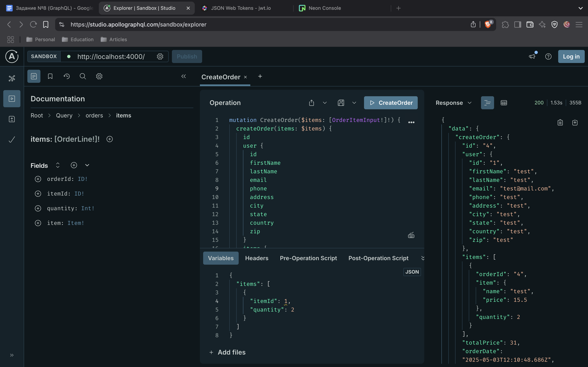
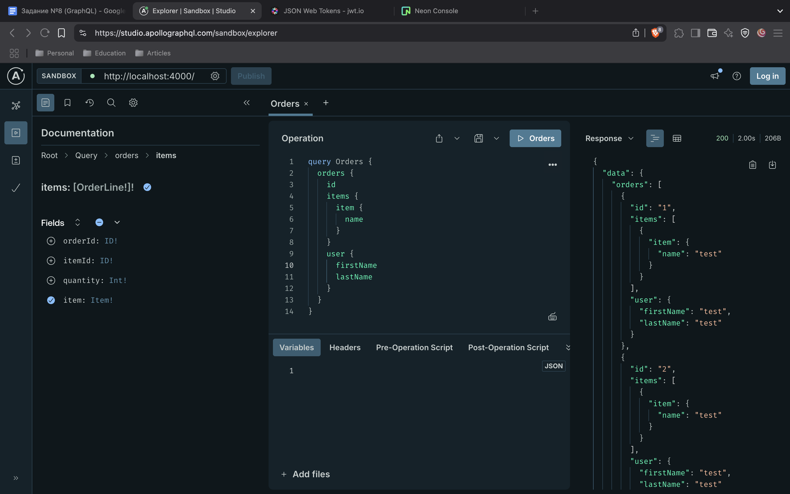
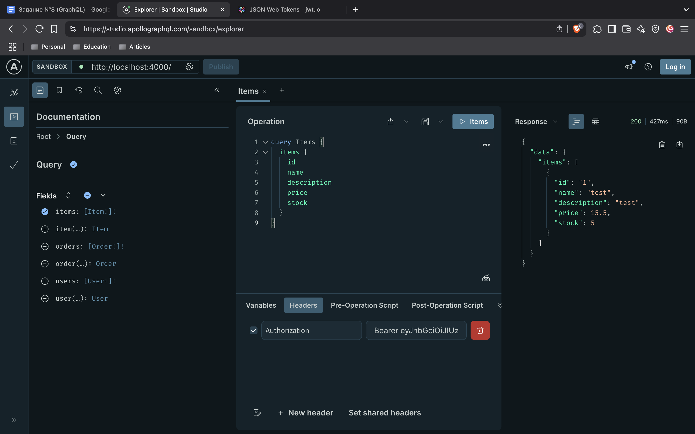
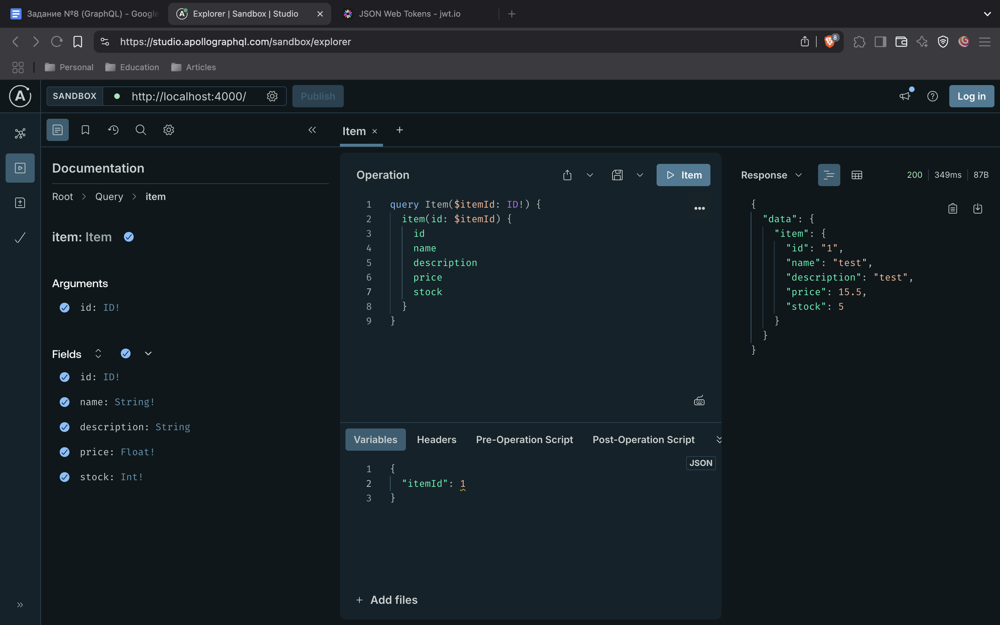

# Практическая работа №8 (GraphQL)

## Ход выполнения

1. Создаем директорию [federation](federation/) и инициализируем в ней микросервисы и gateway с помощью утилиты `npm init -y`.
2. Реализуем схемы для каждого субграфа: [users](federation/users-service/src/schema.ts), [orders](federation/orders-service/src/schema.ts), [items](federation/items-service/src/schema.ts).
3. Добавляем необходимые компоненты для работы микросервисов (работу с БД, утилиты).
4. Тестируем работу субграфов и переходим к реализации gateway.
5. Строим supergraph из существующих микросервисов и описываем логику контекста (для авторизации).
6. Создаем dockerfile'ы для каждого микросервиса и для gateway. Деплоим приложение с помощью [docker-compose](deploy/docker-compose.yaml).
7. Теперь можно опробовать задеплоенное приложение по адресу `http://localhost:4000/`.

## Примеры запросов и функций приложения

[Видео защиты практической работы](https://drive.google.com/file/d/1KJU0iCnAC0GBN_g2jDXFJXQCOk3ct1Nc/view?usp=drive_link)
